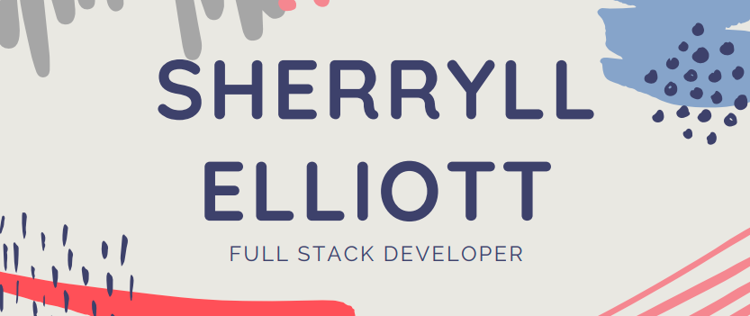

## Hello I'm Sherryll 💻 

### About
I am a second career developer who loves to build things and work with great people. 

I have recently graduated from General Assembly and Im proud to say, you can find all my projects on my portfolio: [sherryllelliott.com](http://sherryllelliott.com). 

### What I'm working on

I am currently developing a handful of web apps using React and a mixture of back end technologies but I'm also spending time digging deeper into Python and the must-knows of Computer Science.

### What I'd like to learn more about

The ethics of Tech and test based development. In the future I'd like to dig into AI and see what there is to learn! 

